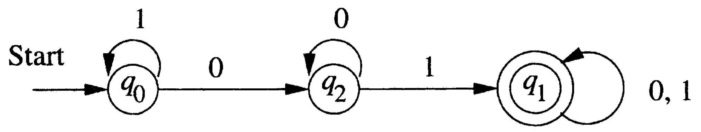
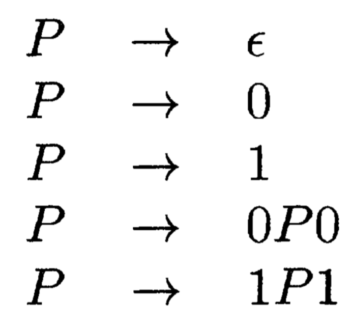
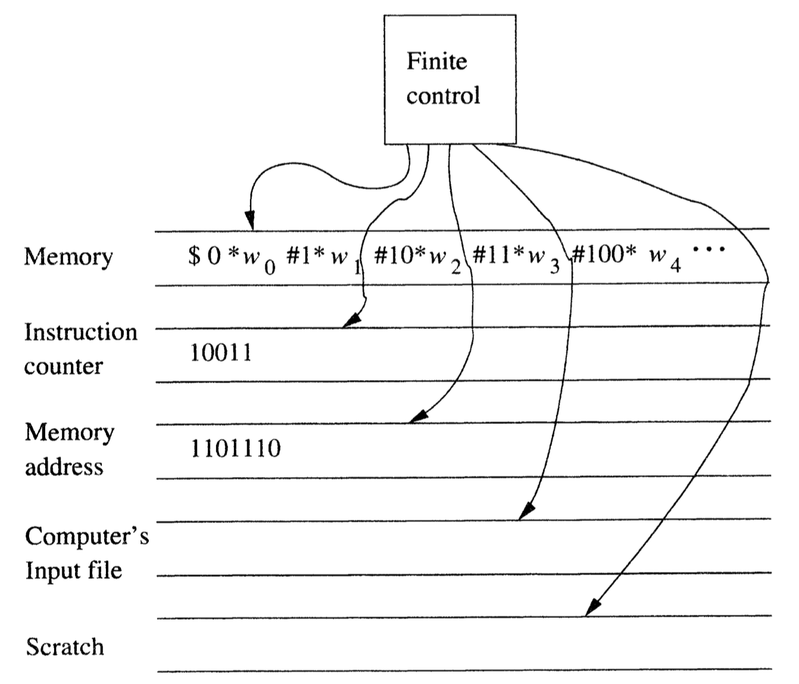
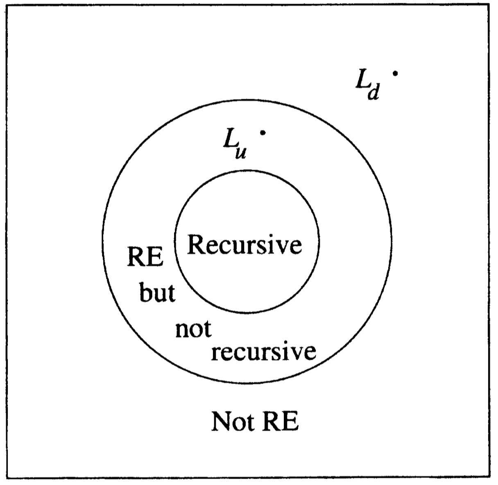

I spent the last two months reading the classic [Hopcroft & Ullman book](http://infolab.stanford.edu/~ullman/ialc.html) on and off, and finally finished today.
Before this, I was relatively familiar with finite automata and context-free grammars, but was completely ignorant of Turing machines.
Also new for me was the tight connection between machines and the languages that they accept.
Here I summarize some key conclusions, as well as some ideas that I find fascinating in the book.

## Finite Automata

In a sense finite automata are the "simplest" machines: based on the input, the finite automaton jumps from one state to another.
Perhaps surprisingly, deterministic and nondeterministic (with or without epsilon-transitions) finite automata are equivalent, though in the worst case conversion from nondeterministic to deterministic will require exponentially many states.
Finite automata represent exactly **regular languages**, and another way to describe regular languages is through **regular expressions**.

As an example, (deterministic) finite automata can accept all and only the strings of 0's and 1's that have the sequence 01 somewhere in the string.

{:width="500px"}

## Pushdown Automata

Pushdown automata can be seen as finite automata augmented with a stack.
This means the transition from one state to another now depends on the top element of the stack as well, in addition to the input symbol.
Pushdown automata represent exactly **context-free languages**, and another way to describe context-free languages is using **context-free grammar**.

As an example, the language of palindromes is a context-free language, but not a regular language.

{:width="150px"}

## Turing Machines and Computers

The definition of Turing machines is farther away from the definitions of finite automata and pushdown automata.
It has a finite control that can move left or right on an infinite tape (initially holding the input string), while also having the ability to change the content on the tape.
A lot of the variants are equivalent, including storage in the state, multiple tracks, multitape etc.
Turing machines represent exactly **recursively enumerable languages**.

As an example, 
\\( \\{ a^n b^n c^n | n \geq 1 \\} \\)
is a recursively enumerable language, but not a context-free language.

While a Turing machine looks nothing like a PC, it has long been recognized as an accurate model for physical computing devices.
I was very much convinced just by the following figure:

{:width="500px"}

Therefore, the language for a Turing machine to accept is no different than the problem for a computer to solve.
Obviously there are different difficulty levels, from hard to easy:

### No Turing Machines Can Accept

Despite the power of Turing machines, there are languages that no TMs can accept, i.e., they are outside the recursively enumerable language.
In order to understand this, we need to develop codes for Turing machines, such that they can be numbered and ordered.

The idea is that: one rule in the TM's transition function takes the form 
\\( \delta(q_i, X_j) = (q_k, X_l, D_m) \\)
, where 
\\(q_i, X_j, q_k, X_l, D_m\\) 
are current state, current tape symbol, next state, rewrite tape symbol, move direction.
We can encode this rule by the string
\\(0^i 1 0^j 1 0^k 1 0^l 1 0^m\\)
. Suppose there are 
\\(n\\)
ordered rules in total, we can encode the entire TM with
\\(C_1 11 C_2 11 \cdots C_{n-1} 11 C_n \\)
. Now we can talk about the *i*-th Turing machine
\\(M_i\\)
, following the order 
\\(\epsilon\\)
is the first string, 0 is the second, 1 is the third, 00 the fourth, 01 the fifth, and so on.

We are now ready to describe the **Diagonalization Language** 
\\(L_d\\)
, the set of strings 
\\(w_i\\)
such that 
\\(w_i\\)
is not in 
\\(L(M_i)\\)
. To understand this language, consider a table where row *i* column *j* is either 0 or 1, representing whether the TM 
\\(M_i\\)
accepts input string 
\\(w_j\\)
. We may think of the *i*-th row as the characteristic vector for the language 
\\(L(M_i)\\)
.

The diagonal values tell whether 
\\(M_i\\)
accepts
\\(w_i\\)
.
To construct 
\\(L_d\\)
, we complement the diagonal.
The trick is, this complement of the diagonal is itself a characteristic vector describing membership in some language, namely 
\\(L_d\\)
. This characteristic vector disagrees in some column with every row of the table.
Thus, the complement of the diagonal cannot be the characteristic vector of any Turing machine!

### Turing Machine Not Guaranteed to Halt (Undecidable)

These are languages within RE, but are accepted in an inconvenient way: if the input is in the language, we will eventually know that, but if the input is not in the language, then the Turing machine may run forever, and we shall never be sure the input won't be accepted eventually.
These languages are called **not recursive**, and the corresponding problems are called **undecidable**.

The **Universal Language** 
\\(L_u\\)
, the set of binary strings representing a TM and an input accepted by that TM, is an example of such.
The code for the TM 
\\(M\\)
and the code for the input string 
\\(w\\)
are separated by string 111.
The proof is by contradiction: if 
\\(L_u\\)
were recursive, then its complement is also recursive by theorem.
But if we have a TM to accept the complement of 
\\(L_u\\)
, then we can construct a TM to accept
\\(L_d\\)
.

{:width="300px"}

### Turing Machine Cannot Solve in Polynomial Time (Intractable)

Recursive languages (i.e., decidable problems) are nice, because they correspond to our informal notion of an "algorithm", a well-defined sequence of steps that always finishes and produces an answer.
However, there is still the issue of efficient versus inefficient.

Formally, we say a language is in the class
\\(\mathcal{NP}\\)
(nondeterministic polynomial) if there is a *nondeterministic* TM that can accept all strings in the language within polynomial time of input length.
One famous 
\\(\mathcal{NP}\\)
example is the Traveling Salesman Problem.
The reason is that with a nondeterministic computer, we could guess a permutation of the nodes, and then compute the total weight for the cycle of nodes.
No branch would use more than 
\\(O(n)\\)
steps if the input was of length *n*.
On a multitape NTM, we can guess a permutation in 
\\(O(n^2)\\)
steps and check its total weight in a similar amount of time.

### Turing Machine Solvable in Polynomial Time (Tractable)

We have finally reached the easiest level within RE languages.
We say a language is in class
\\(\mathcal{P}\\)
if there is a *deterministic* TM that can accept all strings in the language within polynomial time of input length.

And we don't know yet if 
\\(\mathcal{P} = \mathcal{NP}\\)
! 
