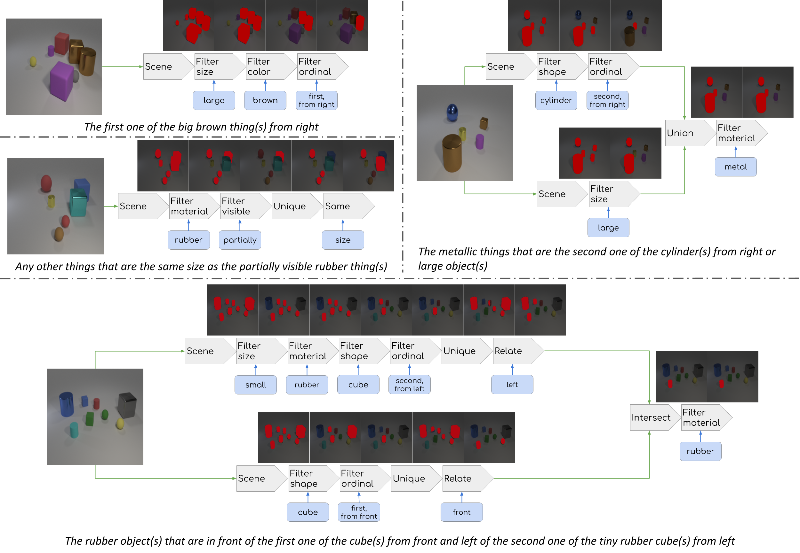

In this project we construct the **CLEVR-Ref+ dataset**, by repurposing and augmenting [the CLEVR dataset](https://cs.stanford.edu/people/jcjohns/clevr/) from VQA towards referring expressions. This synthetic diagnostic dataset will complement existing real-world ones:

{:width="1000px"}

There are two main reasons we did this:

- One is to test and diagnose state-of-the-art referring expression models at a more detailed level than the detection accuracy or segmentation IoU, including our proposed **IEP-Ref model** that explicitly captures compositionality. 

- The other is to perform step-by-step inspection of the model's reasoning process. We are especially interested in whether the neural modules in Neural Module Networks indeed perform the intended functionalities when trained end-to-end. According to our experiments, the answer is quite positive:

{:width="1000px"}

## Download Links

[\[Paper\]](https://arxiv.org/abs/1901.00850)

[\[CLEVR-Ref+-v1.0 Dataset (16GB)\]](https://cs.jhu.edu/~cxliu/data/clevr_ref+_1.0.zip)

[\[CLEVR-Ref+-CoGenT-v1.0 Dataset (19GB)\]](https://cs.jhu.edu/~cxliu/data/clevr_ref+_cogent_1.0.zip)

[\[Code for CLEVR-Ref+ Dataset Generation\]](https://github.com/ccvl/clevr-refplus-dataset-gen)

[\[Code for IEP-Ref Model\]](https://github.com/ccvl/iep-ref)