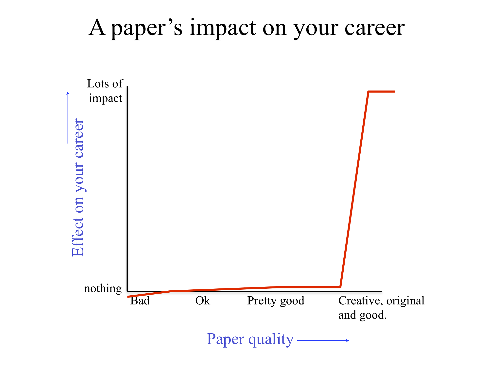

For many years I was one of the most senior students in our group, and two months ago I successfully defended my PhD. The former gives me desire/responsibility to share what I have learned/experienced, and the latter entitles me to do so. So here they are: 3+1 (roughly sequential) lessons/guidelines/principles that I think can help build your PhD career. "Successful" is in parenthesis hence optional: though something we all aspire to, it is subjective and often times random.

### Read tons of papers

English is not my first language; the time I feel my English improved the most was when I put in the work and expanded my vocabulary by thousands in high school. Similarly, I feel my research improved the most when I put in the work and read tons of papers in my senior year and first year of graduate school. 

In some sense this is the easiest, as little "talent" is required, but also the hardest, as this cannot be achieved over a short period of time.

With the current explosion of AI papers, fewer and fewer people have the energy to keep up with multiple frontiers: but this gives *more* advantages to those who still do! In addition, it is super interesting and rewarding to see the connections of seemingly far-away research areas (one personal example: [scene graph parsing as dependency parsing](https://arxiv.org/abs/1803.09189)), so that you end up with an even *simpler* and *deeper* understanding of the problem. 

So at what point have you read "enough" papers? Well you never do; but here are some good "milestones". The baseline should be you now feel comfortable and confident writing a *survey* in this area ([personal examples](https://cs.jhu.edu/~cxliu/2016/deep-learning-seminar.html) that are not necessarily good). This means you at least have perused the papers that people commonly cite in the Related Work section. The next level is to start forming *opinions* and *tastes*: you start to doubt whether every paper you read is a good one. Here is when you are on your way to becoming a (qualified) reviewer. Also, now that you are a good discrimator, the chance of you being a good generator also increases. Ultimately, the goal is to form your own *organization* and *vocabulary*, which is like a library indexing system, so that when a new paper/idea comes in, you can easily fit it in your system, and effortlessly point out its relations to others. As aforementioned, the more papers you read, the simpler/smaller this system should be. This could be intuitive to some but counter-intuitive to others.

### Optimize the quality of your *best* paper

Among the 3+1 points in this post, this one is probably the most self-explanatory. No matter how famous you get, at the end of the day, you are only going to be remembered for very few things. So optimize the quality of your best paper, maximize its impact, as this will be closely associated with your name. I cannot say it any better than this [figure from Bill Freeman](https://billf.mit.edu/sites/default/files/documents/cvprPapers.pdf):

{:width="500px"}

But what I did not realize until the last-day-of-internship-lunch with my Adobe mentors is that: ideally this should be done *fast*, like within the first 2 years of your PhD assuming you are not doing a postdoc. The reason is that you need time for the community to absorb and accept your work before its impact can start to accumulate. In other words, the only way to show your work can withstand the test of time is through time. So develop a sense of urgency you junior PhD students! :)

### Optimize the quality of your *worst* paper

My next advice is to optimize the quality of your *worst* paper. As a cheesy analogy, your best paper is like what you use to attract/impress your dates on the first date; but a sustained relationship/marriage is certainly more dependent on your bad habits. In other words, your best paper vs your worst paper is like attracting people over vs keeping them around.

This point is arguably more problematic than the preceding one, as researchers can certainly possess a different research philosophy and not put this into their top priorities. But again with the explosion of AI papers, the effect of branding (of authors or institutions) gets amplified: nowadays it is reassuring to know in advance that your time will be well spent reading this paper based on a name you see among the authors (Jason Eisner, Kaiming He, Jon Barron, just off the top of my head).

I developed a rough sense of this myself midway through my PhD, but I have to credit these precise words to Carlos Guestrin (as quoted by his student Tianqi Chen in [this post](https://zhuanlan.zhihu.com/p/74249758) in Chinese). Keeping this standard is not always easy, particularly because it almost inevitably involves saying no to projects/co-authorship. This is almost the complete opposite of what very junior PhD students should be doing when they are expanding their horizons/getting their publication record started. 

### *Job talk: don't waste your audience's time

This final point is listed with an asterisk, because it doesn't parallel the others, but somewhat summarizes them in a uniform but less direct way. 

At the end of your PhD, you do 2 important things: find a job, and do the defense. And let's face it: the former is typically more stressful than the latter, as this involves "going outside" and "proving yourself" to people who were not familiar with you, to say the least. Now here's the thing: whether you do so in academia or industry, and even if you think you are a nobody, chances are that there *will be* awesome people --- think those who you only see delivering keynotes/accepting awards --- at your job talk. So don't waste their time!

Of course, if you are realizing this when your eyes meet theirs, it is too late and there is not much you can do. That is why I am writing this warning down, so that you can prepare early. In other words, you could try setting this as the objective, and "backpropagate" to guide your choices during PhD. 

Regarding the points I try to make in this post:

- Of course, **your best paper** will command a big chunk of your job talk. It should withstand all scrutiny and tough questions. In fact, this work was probably the the main reason that got you through the candidate screening and you standing here.
- It is very rare in job talks to talk about one project only. Universities and companies are not hiring you for what you have done in the past: they can just go to github and fork it! They are hiring you because you have *continuously* brought innovations, and they believe this will continue in the future. So optimizing **your worst paper** (i.e. showing that you do not have a significant drop-off from your best to your second best) very much aligns with this goal and demonstrates your ability to "quality control" on your own.
- After your job talk, you will be talking to other professors/interviewers for the rest of the day. They (usually intentionally) come from a wide range of background. So **extensive reading** gives you a much higher chance at a meaningful exchange rather than an awkward silence (which wastes their time). 

Away from these main points, this objective could effectively guide other situations you may encounter in your PhD too. For example, suppose you have an A+B type of idea but without any insight beyond those from A and B individually. You realize even if it publishes as a poster, you do not feel comfortable at all talking about it in your job talk in front of awesome people. So you may want to steer away from it and spend your energy on something else. Another situation is when you are pre-planning your job talk, you realize the 2 papers you have are more like steps 1 and 3; in that case, you might want to drop everything else and focus on publishing step 2, to make the story more coherent and material more solid. 

Staying within the topic of saving other people's time, I sincerely hope my sharing can help you save some time/cut some corners in your PhD career (which I know can be tough sometimes). If any of you feels so, I would consider my afternoon very well spent. 